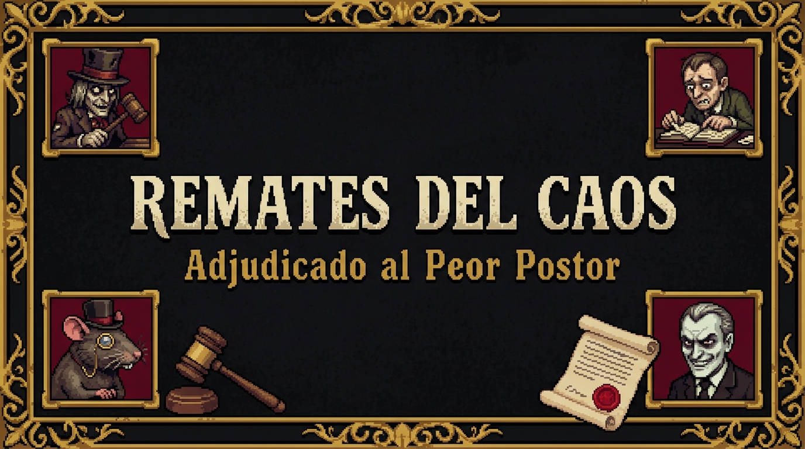
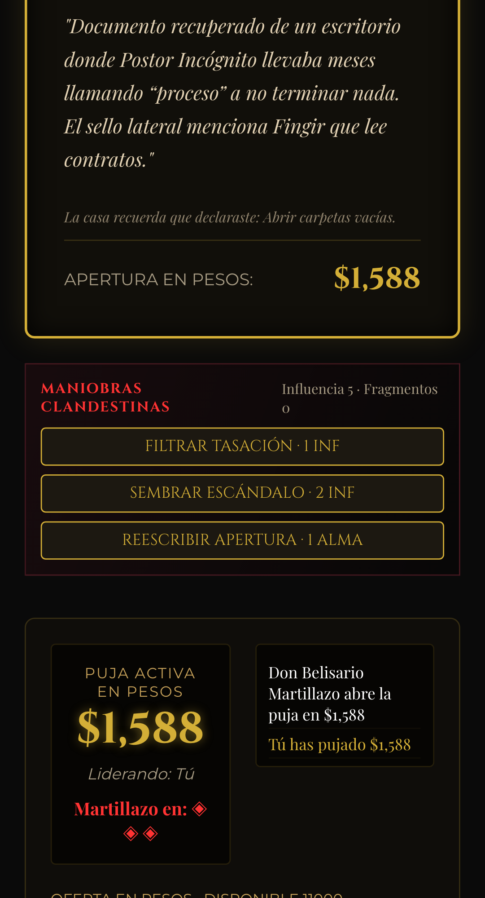
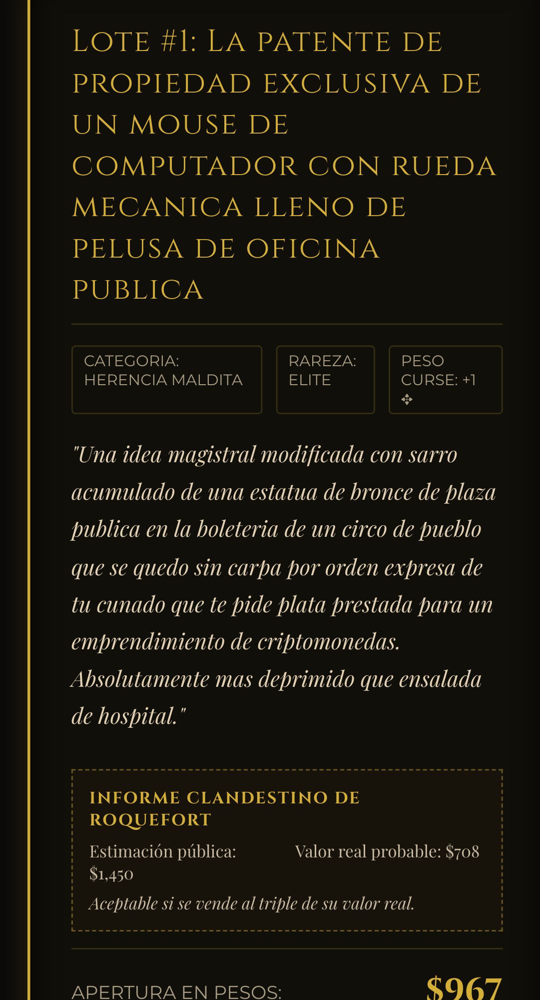
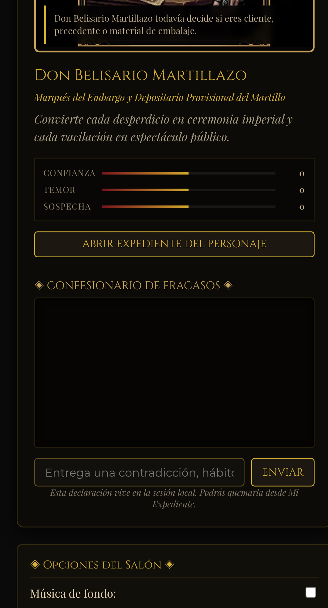
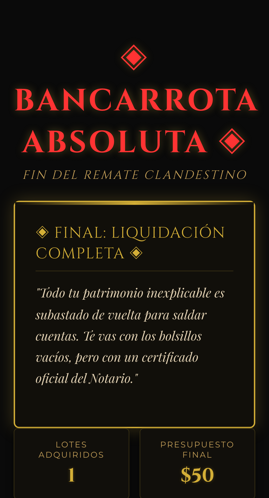
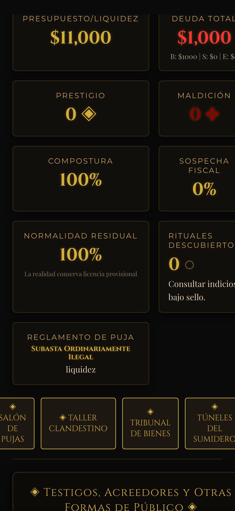

# REMATES DEL CAOS

### Adjudicado al Peor Postor

[](https://github.com/kegouro/remates-del-caos/actions/workflows/deploy-pages.yml)
[](https://kegouro.github.io/remates-del-caos/)
[](LICENSE)
[](https://react.dev)
[](https://www.typescriptlang.org/)

[🎭 JUGAR AHORA](https://kegouro.github.io/remates-del-caos/)

---



> Tienes diez mil pesos, ningún criterio y una silla reservada en el subsuelo de **Mortaja, Martillo & Cía.**

**Remates del Caos** es un roguelite narrativo de subastas, deudas, objetos malditos y burocracia espectral. Funciona como un juego web estático en React, TypeScript y Vite, ejecutable localmente y sin requerir un servidor de base de datos ni credenciales de IA externas.

No pretende resolver un problema real. Pretende averiguar cuánto pagarías por una tetera que recuerda discusiones y qué diría una rata aristócrata al respecto.

---

## Galería del Salón

| 1. Entrada al Salón | 2. Declaración Jurada |
| :---: | :---: |
|  |  |

| 3. Subasta con Rivales | 4. Anomalías & Trucos |
| :---: | :---: |
|  |  |

| 5. Auditoría de Deuda | 6. Prensa Reactiva | 7. Vista Móvil |
| :---: | :---: | :---: |
|  |  |  |

---

## Qué ocurre dentro

- **Interrogatorio procedural:** la Declaración Jurada de Dudosa Relevancia construye un expediente local a partir de preguntas extrañas, hábitos, objetos vergonzosos y contradicciones.
- **Hostilidad configurable:** desde cortesía diplomática hasta Auditoría Sin Abogado. Los personajes reutilizan información autorizada para elaborar roasts contextuales, no insultos genéricos.
- **Director de delirio:** administra motivos recurrentes, microeventos, anomalías, pausas y mutaciones de reglas. La rareza tiene ritmo y memoria.
- **Subastas con monedas incorrectas:** algunos lotes se pagan con liquidez, compostura, prestigio o deuda heredada.
- **Presagios contractuales:** cada campaña comienza eligiendo una profecía jugable. Cumplirla produce recompensas, callbacks y una humillación jurídicamente premeditada.
- **Salón con pulso:** el público, los rivales y el propio edificio reaccionan por separado. Los rivales acumulan rencor, revelan tics y cambian su tolerancia a la puja.
- **Maniobras clandestinas:** influencia y fragmentos de alma permiten filtrar tasaciones, sembrar escándalos y reescribir precios de apertura.
- **Contratos con la casa:** cuando el edificio tiene hambre puede pedir objetos, compostura, nombre o aplausos futuros a cambio de recursos. Rechazarlo también deja consecuencias.
- **Remate del Día:** la fecha UTC genera una semilla y un modificador común, completamente offline, para comparar la misma desgracia con otras personas.
- **Peticiones del patrimonio:** los objetos conscientes pueden exigir salario, sindicalizarse, iniciar una demanda o registrarte como parte de su inventario.
- **Rituales secretos:** combinaciones improbables de objetos, rechazos, deudas y evidencia despiertan ceremonias únicas. El catálogo muestra pistas veladas y registra únicamente lo descubierto.
- **Prensa exportable:** *El Avalúo Nacional* produce portadas reactivas que pueden guardarse como PNG o copiarse sin extraer confesiones crudas.
- **Patrimonio con agencia:** los objetos pueden despertar, sindicalizarse, litigar y terminar figurando como propietarios del jugador.
- **Dieciséis personajes:** cada uno posee voz, deseo, herida, secreto, relaciones y una forma propia de destruir tu autoestima administrativa.
- **Campaña por actos:** eventos, jefes, minijuegos, taller, tribunal, noticias procedurales, finales y un Libro de Actas de accidentes legalmente ocurridos. Incluye Remate Breve, Noche Completa y Remate Interminable.
- **Evidencia voluntaria local:** el jugador puede entregar nombres y metadatos de archivos, texto pegado o una imagen para extraer una paleta. Nada se lee sin selección explícita y el contenido no se envía a servidores.
- **Audio local:** música sintetizada, martillazos, ambientes y voces mediante APIs del navegador.
- **Semillas reproducibles:** la estructura procedural puede repetirse sin depender de IA ni backend.

---

## Habitantes del subsuelo

**Don Belisario Martillazo** convierte cada pérdida en ceremonia. Sospecha que él también fue subastado.

**Casimiro Coimán** vende información confidencial y quizá posee un certificado de defunción falso.

**Sir Roquefort III** dirige el Banco de Migas y considera a la humanidad un activo depreciado.

**Don Sanguino** presta futuros donde todavía tenías dinero y llama al alma “garantía inmaterial”.

La Fiscal Serafina Timbre, Maese Engrudo, Madame Balance, la Cobradora de las 4:17 y otras criaturas completan un consejo de dieciséis enemigos potenciales.

---

## Modos de expediente

- **Incógnito Patrimonial:** inventa todos los datos.
- **Visita Diplomática:** personalización y roasts suaves.
- **Contabilidad Nocturna:** experiencia equilibrada.
- **Fiebre Patrimonial:** más anomalías y callbacks.
- **Auditoría Sin Abogado:** modo adulto, hostil y deliberadamente personal. Requiere confirmación explícitamente autorizada y permite borrar la munición durante la partida.

> [!WARNING]
> **Advertencia de contenido:** El juego incluye humor negro, lenguaje adulto y un modo opcional de hostilidad personalizada. La intensidad puede configurarse o desactivarse en las opciones del expediente.

---

## Privacidad y Seguridad

La aplicación está diseñada bajo el principio de soberanía de datos del jugador:

- **Sin backend:** El juego corre enteramente en tu navegador. Ningún dato sale a un servidor externo.
- **Sin telemetría ni analítica:** No registramos tus clics, hábitos ni comportamiento.
- **Sin credenciales ni llamadas externas:** Las conversaciones e interrogatorios son locales y procedimentales, sin depender de servicios de terceros ni APIs generativas comerciales.
- ** session & local Storage:** La partida activa, tus respuestas a la Declaración Jurada, los diálogos del chat y el expediente viven exclusivamente en `sessionStorage` (se destruyen al cerrar la pestaña). Las preferencias visuales, logros obtenidos y rituales descubiertos se guardan en `localStorage` (persisten localmente).
- **Control absoluto:** Puedes limpiar todas tus preferencias y logros directamente desde el menú del juego en cualquier momento.
- **Modo Incógnito:** Puedes usar la opción de expediente apócrifo para jugar de forma anónima sin proveer ninguna información.

> [!NOTE]
> La casa puede fingir omnisciencia como personaje. El software no espía.

---

## Desarrollo Local

Requisitos: Node.js 22+.

1. Instalar dependencias:
   ```bash
   npm ci
   ```
2. Iniciar servidor de desarrollo local:
   ```bash
   npm run dev
   ```
3. Ejecutar suite de pruebas y compilación completa:
   ```bash
   npm run check
   ```

Comandos de test individuales:
- `npm run typecheck` (validación estática de TypeScript)
- `npm run lint` (linter de código)
- `npm run test` (pruebas unitarias con Vitest)
- `npm run build` (compilación a producción en `dist/`)
- `npm run test:e2e` (pruebas de humo y capturas con Playwright)

---

## Arquitectura

```text
src/
├── app/                    interfaz y escenas
├── audio/                  síntesis, voces y efectos
├── components/             salón, expediente, anomalías e inventario
└── game/
    ├── campaign/           delirio, presagios, contratos, personajes, formatos, eventos y finales
    ├── engine/             decisiones de rivales
    ├── generators/         lotes, roasts y texto procedural
    ├── persistence/        sesión, preferencias y logros
    ├── state/              máquina de estados y reducer
    └── tests/              pruebas unitarias y simulaciones de campañas
```

El motor procedural es independiente del framework visual (React), permitiendo ejecutar campañas y simulaciones de rituales directamente desde la CLI. La versión 1.1.0 contiene 47 pruebas unitarias con simulación completa de campañas breves, infinitas e interacciones de rituales.

---

## GitHub Pages

El despliegue en GitHub Pages está configurado a través del workflow oficial [.github/workflows/deploy-pages.yml](.github/workflows/deploy-pages.yml). Utiliza la configuración portátil de Vite (`base: './'`), lo que permite alojar la aplicación de forma compatible con subrutas de proyecto.

---

## Legado Streamlit

El prototipo original del juego desarrollado en Python y Streamlit está disponible en la carpeta [legacy/streamlit/](legacy/streamlit/). No es necesario para disfrutar de la experiencia moderna en React.

---

## Licencia

MIT. Los assets gráficos y retratos incluidos forman parte del proyecto y están optimizados para distribución web estática bajo licencia abierta.

---

### English Summary

A browser-only procedural auction roguelite about cursed property, predatory debt, hostile bureaucracy and objects that may eventually acquire their buyer. It runs locally with React and TypeScript, requires no generative-AI service, and includes a configurable narrative dossier that can remain entirely fictional. Play online on [GitHub Pages](https://kegouro.github.io/remates-del-caos/).
